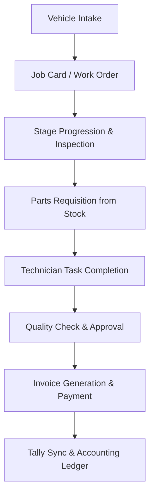
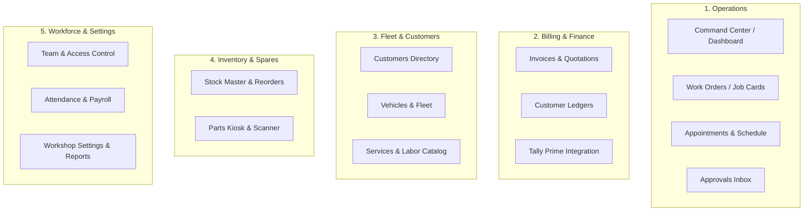

# GarageCommon Platform: Complete UI/UX Analysis & Redesign Blueprint

> **Executive Objective**: Transform the platform into an **exceptionally intuitive, simple, clean, and elegant automotive workshop management system** that operators, technicians, accountants, and owners can master in minutes without training.

---

## 1. Current Pages & Screens Inventory

The application currently contains **31 distinct route endpoints** across 4 permission tiers (`admin`, `manager`, `staff`, `customer`):

| Route | Page Component | Current Primary Function | Complexity & File Size |
|---|---|---|---|
| `/dashboard` | `Dashboard.tsx` | Role-based redirect router | Small (~1 KB) |
| `/auth` | `Login.tsx` | Authentication (email/password & magic link) | Medium (~12 KB) |
| `/admin` | `Dashboard.tsx` | Workshop Command Center (KPIs, active WOs, low stock, clock) | High (~25 KB) |
| `/admin/work-orders` | `WorkOrders.tsx` | Job cards list, delivery countdowns, appointments bridge | Very High (~44 KB) |
| `/admin/work-orders/:id` | `WorkOrderDetail.tsx` | Full job card detail, tasks, staff assignments, stages, parts | Extremely High (~171 KB) |
| `/admin/progress` | `Progress.tsx` | Work order stage progress tracker (duplicate view of WOs) | High (~22 KB) |
| `/admin/appointments` | `Appointments.tsx` | Booking calendar, customer appointments, time slots | High (~59 KB) |
| `/admin/requests` | `RequestsInbox.tsx` | Central inbox for pending approvals (WOs, parts, payments, leave) | High (~40 KB) |
| `/admin/requests/confirmation` | `RequestConfirmation.tsx` | Dedicated confirmation page for request approvals | Small (~4 KB) |
| `/admin/customers` | `Customers.tsx` | Customer directory, contact cards, vehicle relationships | High (~70 KB) |
| `/admin/customers/:id/ledger` | `CustomerLedger.tsx` | Specific customer statement of account & balance history | High (~22 KB) |
| `/admin/vehicles` | `Vehicles.tsx` | Fleet directory, license plate lookup, owner links | High (~20 KB) |
| `/admin/vehicles/:id` | `VehicleDetail.tsx` | Vehicle lifecycle, history, service records, FC tracking | High (~33 KB) |
| `/admin/invoices` | `Invoices.tsx` | Bill listings, draft bills, ready-to-bill work orders, receipts | High (~56 KB) |
| `/admin/invoices/:id` | `InvoiceEditor.tsx` | Line-item editor, GST calculations, discounts, PDF preview | Extremely High (~112 KB) |
| `/admin/ledger` | `Ledger.tsx` | Global billing ledger, debits/credits across all customers | High (~33 KB) |
| `/admin/tally` | `Tally.tsx` | Direct sync to Tally Prime port 9000 & XML/CSV exports | High (~59 KB) |
| `/admin/inventory` | `Inventory.tsx` | Parts inventory, SKU, categories, stock balance, QR printing | Extremely High (~103 KB) |
| `/inventory/room` | `InventoryRoom.tsx` | Barcode/QR scanning kiosk for mechanics picking parts | High (~53 KB) |
| `/inventory/login` | `InventoryLogin.tsx` | Kiosk mode passcode/quick login | Small (~7 KB) |
| `/admin/services` | `ServicesMaster.tsx` | Master labor types, standard pricing, task breakdown | High (~100 KB) |
| `/admin/booking-catalog` | `BookingCatalog.tsx` | Customer-facing service packages catalog | High (~21 KB) |
| `/admin/employees` | `Employees.tsx` | Employee list, positions, departments, contact info | High (~28 KB) |
| `/admin/attendance` | `Attendance.tsx` | Punch-in records, shift logging, daily attendance matrix | High (~90 KB) |
| `/admin/salary` | `SalaryManagement.tsx` | Monthly payouts, advance deductions, wage calculations, payslips | High (~61 KB) |
| `/admin/users` | `Users.tsx` | User credentials, role assignments, auth accounts | High (~29 KB) |
| `/admin/access-control` | `AccessControl.tsx` | Route & feature permissions by role | High (~14 KB) |
| `/admin/analytics` | `Analytics.tsx` | General workshop performance metrics & charts | Medium (~14 KB) |
| `/admin/invoice-analytics` | `InvoiceAnalytics.tsx` | Revenue trends, collections, customer spending breakdowns | High (~63 KB) |
| `/admin/analytics-dashboard` | `AnalyticsDashboard.tsx` | 360° analytics by company or vehicle | Medium (~11 KB) |
| `/admin/settings` | `Settings.tsx` | Workshop profile, GSTIN, invoice prefixes, signatures | High (~90 KB) |
| `/staff` | `Dashboard.tsx` | Mobile-first staff portal (assigned jobs, inspection checklists) | High (~76 KB) |
| `/staff/attendance` | `StaffAttendance.tsx` | Staff self check-in / check-out | High (~27 KB) |
| `/customer` | `Portal.tsx` | Customer self-service portal (live tracking, quote approval, bills) | Extremely High (~169 KB) |

---

## 2. Navigation Structure Analysis

### Current State
The desktop and mobile navigation currently presents a **flat list of 23 navigation links** divided arbitrarily into 7 collapsible groups in `AdminSidebar.tsx`:
1. **Dashboard** (single link)
2. **Operations**: Inbox, Appointments, Work Orders, Progress
3. **Fleet & CRM**: Customers, Vehicles, Services Master, Booking Catalog
4. **Inventory Room**: Stock Master, Scanning Kiosk
5. **Billing & Finance**: Invoices, Ledger, Salary & Payouts, Tally Integration
6. **Analytics**: Performance, Financials, 360° Analytics
7. **Workforce**: Employees, Attendance Control
8. **System Settings**: User Accounts, Access Control, Configuration

### Navigational Problems & Friction
- **Excessive Grouping & Nesting**: Finding a basic screen requires remembering which group it is hidden inside and expanding it.
- **Top HUD Notch Collision**: `GlobalHUD.tsx` renders a persistent black notch floating over top breadcrumbs and screen headers on every admin page.
- **Fixed Topbar Offset Hack**: A hardcoded `<style>` tags `padding-top: 4.5rem !important` across all pages, causing layout jumping and clipping on smaller laptops.
- **Mobile Menu Fatigue**: On tablet and mobile, the sidebar drawer is so tall that finding actions requires excessive scrolling.

---

## 3. Major Features & Capabilities



1. **Intake & Appointments**: Customer books online or walks in $\rightarrow$ Appointment converted into Work Order in 1 click.
2. **Dynamic Work Order Lifecycle**: Progresses through configurable stages (*Brief $\rightarrow$ Inspection $\rightarrow$ Estimation $\rightarrow$ Approval $\rightarrow$ Repair $\rightarrow$ Quality Check $\rightarrow$ Delivery*).
3. **Task & Labor Management**: Multi-service support (Mechanical, Electrical, Bodywork, AC) with technician assignment and rate calculation.
4. **Inventory & QR Tracking**: Part master with SKU, reorder level, barcode/QR label printing, and scanning kiosk for mechanics.
5. **Invoicing & Payments**: Quotation to invoice conversion, GST (CGST/SGST/IGST), customer deductions, and payment verification.
6. **Accounting & Tally Sync**: 1-click direct HTTP sync to Tally Prime (`localhost:9000`) and XML export for offline accountants.
7. **Workforce Management**: Biometric/manual attendance, overtime, session-based wages, and salary slip generation.
8. **Customer & Staff Portals**: Real-time vehicle repair stage tracking for vehicle owners; task-focused interface for mechanics.

---

## 4. User Workflows & Pain Points

### Workflow 1: Creating & Managing a Work Order (Job Card)
- **Current Flow**:
  1. User navigates to `/admin/work-orders`.
  2. The page loads 4 stats cards, an urgent alert banner, a form container, an appointments carousel, search filters, sort dropdown, and active/completed tabs.
  3. User clicks "Create Work Order", filling customer, vehicle, services, labor, and delivery date in a large modal.
  4. After creation, user opens `/admin/work-orders/:id`.
  5. The detail page has **2,884 lines of un-tabbed vertical content**: customer details, stage tracker, assignment requests, labor tasks, parts requested, internal notes, and delivery countdown.
- **Friction**: The user is overwhelmed by too much information at once. Critical actions (e.g. "Mark Inspection Complete", "Assign Mechanic", "Print Work Slip") get lost amidst hundreds of lines of text.

### Workflow 2: Billing & Invoice Generation
- **Current Flow**:
  1. Once vehicle repair is completed, user navigates to `/admin/invoices`.
  2. Tab switching between "Ready to Bill" vs "Drafts" vs "All Invoices".
  3. Clicks "Create Invoice", selecting the work order.
  4. Opens `/admin/invoices/:id` (112 KB editor), fills out line items, discounts, taxes.
  5. Navigates separately to `/admin/ledger` or `/admin/tally` to verify balance and sync to accounting.
- **Friction**: The invoice status is separated from the work order. When a job card is marked "Ready for Delivery", there is no immediate 1-click "Generate Final Invoice" shortcut on the job card itself.

### Workflow 3: Inventory Requisition by Mechanics
- **Current Flow**:
  1. Mechanic requests a brake pad on `/staff` dashboard.
  2. Request appears in `/admin/requests` under "Part Requests" tab.
  3. Storekeeper approves it in `/admin/requests` or scans it in `/inventory/room`.
  4. Admin checks remaining balance in `/admin/inventory`.
- **Friction**: 3 separate pages for 1 simple part requisition process.

---

## 5. Existing UI Components & Styling

- **Component Framework**: Radix UI primitives with Tailwind CSS utilities (shadcn/ui design language).
- **Core Building Blocks**:
  - `Card`, `CardHeader`, `CardTitle`, `CardContent`, `CardDescription`
  - `Button` (default, outline, ghost, destructive, secondary)
  - `Badge` (used heavily for status indicators)
  - `Table`, `TableHeader`, `TableRow`, `TableCell`
  - `Tabs`, `TabsList`, `TabsTrigger`, `TabsContent`
  - `Dialog`, `AlertDialog`, `Sheet`, `Popover`, `DropdownMenu`
  - `Input`, `Select`, `Checkbox`, `Switch`, `Textarea`
  - `ProgressTracker`, `GarageClock`, `CompactProgressTracker`

---

## 6. Unnecessary, Redundant, or Cluttering Elements

| Redundant Element | Location | Why It Clutters | Recommended Solution |
|---|---|---|---|
| **Global Floating Notch HUD** | Top center of all pages (`GlobalHUD.tsx`) | Floats over page titles, adds visual distraction, duplicates dashboard clock. | Remove persistent floating notch. Move notifications to standard topbar bell icon. |
| **Separate `/admin/progress` page** | Standalone page | Duplicates `/admin/work-orders`. Both show work order stages. | Merge progress stage filter as a clean view mode toggle inside Work Orders. |
| **3 Fragmented Analytics Pages** | `/admin/analytics`, `/admin/invoice-analytics`, `/admin/analytics-dashboard` | Users never know which analytics page has the report they need. | Consolidate into 1 unified **Reports & Insights** hub with clear tabs. |
| **Separated Services & Booking Catalog** | `/admin/services` & `/admin/booking-catalog` | Both manage services; one is internal master, one is customer packages. | Merge into **Services & Rates** with sub-tabs for "Service Master" and "Customer Packages". |
| **Users vs Employees Separation** | `/admin/users` vs `/admin/employees` | Both represent the same staff members (one auth, one profile). | Merge into unified **Team & Access** directory with role management. |
| **Duplicate Customer Ledgers** | `/admin/ledger` & `/admin/customers/:id/ledger` | Redundant navigational split. | Keep global ledger as a tab in Billing; individual ledger inside the Customer profile drawer. |
| **Excessive Dashboard Colorful Gradients** | `/admin` Command Center | 5 giant competing saturated gradient cards (orange, blue, emerald, violet) create visual noise. | Use clean, modern metric cards with subtle borders and clear typography. |
| **Excessive Vertical Scroll in Job Card Detail** | `/admin/work-orders/:id` | 2,800 lines of stacked content without tabbed focus. | Implement 4 focused tabs: **1. Overview & Vehicle**, **2. Tasks & Mechanics**, **3. Parts & Materials**, **4. Billing & Notes**. |

---

## 7. Areas Causing Confusion or Friction

1. **Delivery Countdown vs Clock Clutter**:
   - Multiple ticking clocks and countdown badges with bright red/orange alerts appear simultaneously on dashboard, header, and work order cards.
2. **Too Many Steps to Create a Work Order**:
   - The user must enter or select customer, select vehicle, pick category, pick multiple service types, pick tasks, assign technician, pick priority, and pick estimated date in one massive form.
3. **Approval Ambiguity**:
   - A task can be "Pending", "In Progress", "Completed", "Pending Approval", "Approved", "Reviewed", or "Delivered". The terminology is inconsistent across screens.
4. **Tally Disconnect**:
   - Previously hidden under settings. Now streamlined with Direct Sync and XML export, but needs to remain cleanly anchored in Billing.

---

## 8. Features That Should Be Simplified

1. **Dashboard (Command Center)**:
   - Needs to show 4 clear things: **Today's Schedule**, **Vehicles in Progress**, **Pending Approvals/Bills**, and **Quick Actions** ("+ New Job Card", "+ Book Appointment", "+ New Bill").
2. **Work Orders List**:
   - Replace complex stacked banners with a clean segmented view: **In Progress**, **Ready for Pickup**, **Completed**, and **All**.
3. **Work Order Detail Screen**:
   - Organize into clean tabs with sticky action header: "Current Stage", "Quick Assign", "Generate Bill", "Print Work Slip".
4. **Billing & Invoices**:
   - Direct link between finished work orders and invoices: 1-click "Create Invoice from Work Order".
5. **Team & Attendance**:
   - Combine Staff list, today's attendance status, and payouts into one coherent Workforce section.

---

## 9. Features That Must Be Retained & Protected

- **Robust Stage Engine**: Dynamic stages (*Inspection $\rightarrow$ Repair $\rightarrow$ Quality Check $\rightarrow$ Delivery*) are essential for workshop operations.
- **Vehicle Master & VIN/Model FK**: Recently linked vehicle models and categories database must remain intact.
- **Tally Prime Direct Sync & XML**: Port 9000 HTTP sync and customer master ledger generation.
- **Printable Documents**: Clean work slips, estimates, invoices, and QR label stickers.
- **Customer Portal**: Live tracking and estimate approval for car owners.
- **Inventory Barcode Scanning**: Mechanic part requisition workflow.

---

## 10. Recommended UI/UX Improvements

### Design Philosophy: *Modern Minimalist Workshop ERP*
- **Palette**: Deep slate/charcoal neutrals (`#0f172a`, `#1e293b`), crisp crisp white/card backgrounds, single refined primary accent (Indigo/Electric Cobalt `#4f46e5` or Precision Emerald `#059669`), with muted semantic badges (amber for pending, emerald for ready, rose for overdue).
- **Typography**: Clean modern sans-serif (Inter/Plus Jakarta Sans) with crisp tabular numbers for currencies and VINs.
- **Spacing & Layout**: Generous whitespace, rounded-xl borders (`12px-16px`), subtle borders (`border-border/60`), removing harsh drop shadows and neon gradients.
- **Sticky Action Headers**: Detail pages have an action bar at the top containing primary actions and status badge, always visible regardless of scroll depth.
- **Notification Center**: Replace floating notch HUD with a clean standard bell icon in the topbar showing a badge count and dropdown popover.

---

## 11. Proposed Information Hierarchy & Consolidation

Instead of 23 fragmented menu items, the application collapses into **5 Core Pillars**:



---

## 12. Proposed Streamlined Navigation Structure

### Simplified Sidebar Menu (Reduced from 23 items to 5 logical sections)

```text
[ GARAGECOMMON LOGO ]
─────────────────────────────────────────────
• Operations
  ├── Dashboard (Command Center)
  ├── Work Orders (Job Cards) [Badge: Active Count]
  ├── Appointments (Calendar & Bookings)
  └── Inbox (Approvals & Requests) [Badge: Pending Count]

• Billing & Finance
  ├── Invoices & Quotes
  ├── Customer Ledgers
  └── Tally Integration

• Fleet & CRM
  ├── Customers
  ├── Vehicles
  └── Services & Rates

• Inventory
  ├── Stock & Spares
  └── Parts Kiosk (Scan QR)

• Workforce & Admin
  ├── Staff & Roles
  ├── Attendance & Payroll
  └── Settings & Reports
─────────────────────────────────────────────
[ User Profile Card ] [ Logout ]
```

---

## 13. Step-by-Step Implementation Strategy

1. **Phase 1: Shell & Navigation Overhaul**
   - Replace redundant sidebar with the consolidated 5-pillar navigation.
   - Remove disruptive floating notch `GlobalHUD.tsx`. Replace with standard topbar notification bell popover.
   - Standardize responsive page layout containers across all admin pages.

2. **Phase 2: Dashboard Redesign (Command Center)**
   - Replace cluttered, high-contrast gradient cards with clean KPI summary cards.
   - Present a clear 3-column operational layout: Today's Arrivals, Active Floor Board, and Pending Bills/Approvals.

3. **Phase 3: Work Orders & Detail View Streamlining**
   - Clean up Work Orders list filter bar (remove clutter, provide instant search and tabbed status).
   - Redesign `WorkOrderDetail.tsx` into 4 organized tabs: **Overview**, **Tasks & Labor**, **Parts Used**, and **Billing & Delivery**.

4. **Phase 4: Billing & Finance Consolidation**
   - Harmonize Invoices, Customer Ledgers, and Tally Integration into a single cohesive experience.
   - Add 1-click "Create Invoice" button directly inside completed Work Orders.

5. **Phase 5: Inventory & Team Streamlining**
   - Connect parts requests directly between Work Orders and Inventory.
   - Combine Users + Employees + Access Control into a single unified Team directory.
