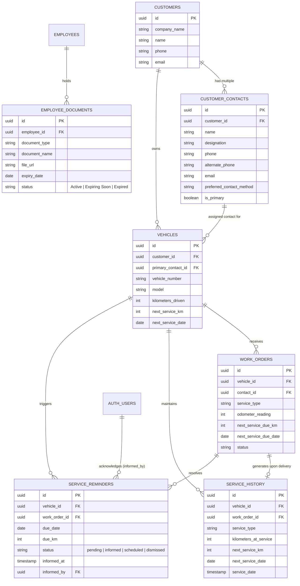

# Vehicle Service Tracking & Notification System
## Architectural Analysis & Implementation Blueprint (Phase 1)

This document provides the foundational data relationship analysis and execution blueprint for connecting **Company, Vehicle, Work Order, Employee, Notification, and Contact** modules without data duplication.

---

## 1. Existing Data Model & Reuse Analysis

| Entity / Table | Existing Fields Reused | Gaps Identified | Solution & Connecting Architecture |
| :--- | :--- | :--- | :--- |
| **Company (`customers`)** | `id`, `name`, `company_name`, `email`, `phone`, `address`, `gst_number` | Only stores a single contact person per company. | Create `customer_contacts` table (`customer_id`, `name`, `designation`, `phone`, `alternate_phone`, `email`, `preferred_contact_method`, `is_primary`). Keep existing fields in `customers` as default primary contact for backward compatibility. |
| **Vehicle (`vehicles`)** | `id`, `customer_id`, `vehicle_number`, `model`, `vehicle_type`, `year`, `kilometers_driven`, `next_service_km`, `next_service_date`, `status` | No specific contact person assigned at vehicle level. | Add `primary_contact_id` (foreign key to `customer_contacts`). Reuse existing `kilometers_driven`, `next_service_km`, and `next_service_date` without adding redundant columns. |
| **Work Order (`work_orders`)** | `id`, `vehicle_id`, `service_type`, `description`, `notes`, `odometer_reading`, `next_service_due_km`, `next_service_due_date` | Next service fields exist in table schema but are underutilized in `WorkOrderForm` and missing in completion modal. | Expose Next Service fields in `WorkOrderForm` during creation and add Next Service review in Work Order Delivery/Completion dialog (`WorkOrderDetail`). Link `contact_id`. |
| **Service Record (`service_history`)** | `id`, `vehicle_id`, `work_order_id`, `service_type`, `service_description`, `work_summary`, `status`, `service_date`, `delivery_date`, `notes` | Missing snapshot of odometer at time of service, target next km, and contact person. | Enhance `service_history` with `kilometers_at_service`, `next_service_km`, `next_service_date`, and `contact_id`. Automatically update `vehicles` when work order is completed. |
| **Reminders (`service_reminders`)** | `NotificationBell` & `RequestsContext` realtime polling infrastructure. | No dedicated table for service due alerts and acknowledgment tracking ("Informed / Okay"). | Create `service_reminders` table (`vehicle_id`, `due_date`, `due_km`, `service_type`, `status`, `informed_at`, `informed_by`). Acknowledged reminders are permanently silenced from active alerts. |
| **Employee Documents (`employee_documents`)** | `employees` table (`id`, `name`, `aadhaar_number`, `pan_number`). | No file storage or document expiry tracking. | Create `employee_documents` table (`employee_id`, `document_type`, `document_name`, `file_url`, `expiry_date`, `status`) + Supabase storage bucket `employee-documents`. |

---

## 2. End-to-End Entity Relationship Diagram

---

## 3. Seven-Phase Implementation Roadmap

### Phase 1 — Data & Existing Application Analysis (Completed)
- Mapped all existing tables, foreign keys, triggers, and UI forms.
- Verified that `vehicles` and `work_orders` already contain `kilometers_driven`, `next_service_km`, and `next_service_date`.
- Designed extension schemas (`customer_contacts`, `service_reminders`, `employee_documents`) that connect seamlessly with zero data redundancy.

### Phase 2 — Service Data Structure & Migration
1. Create Supabase migration file `20261006000000_vehicle_service_tracking.sql`:
   - `customer_contacts` table with RLS.
   - `service_reminders` table with RLS and indexing.
   - `employee_documents` table with RLS and expiry tracking.
   - Add `primary_contact_id` to `vehicles`.
   - Add `contact_id` to `work_orders`.
   - Update `service_history` table to store `kilometers_at_service`, `next_service_km`, `next_service_date`, `contact_id`.
   - Upgrade `auto_create_service_history_v2()` trigger to automatically capture odometer readings and sync vehicle next service targets on completion.

### Phase 3 — Vehicle Service Due Dashboard (`/admin/service-due`)
1. Create new admin page `src/pages/admin/ServiceDue.tsx`:
   - Categorized tabs: **Overdue**, **Due Soon**, **Upcoming**, **Completed / Serviced**.
   - Filters by Company, Vehicle Number, Service Type, Urgency.
   - Displays: Vehicle Number, Model, Company Name, Contact Person (Designation & Phone/Email), Current KM, Next Service KM, Remaining KM, Due Date, Days Remaining, Service Status.
   - Quick action: "Acknowledge / Informed", "Create Work Order", "Call / WhatsApp Contact".
2. Register route `/admin/service-due` in `App.tsx` and add to `AdminSidebar.tsx` under Operations.

### Phase 4 — Multiple Company Contacts
1. Update `CustomerForm.tsx` and `Customers.tsx`:
   - Add Multiple Contacts manager (Owner, Manager, Service Coordinator, Accounts, etc.).
   - Support Name, Role/Designation, Phone, Alternate Phone, Email, Notes, Preferred Method (Phone, WhatsApp, Email), Primary Toggle.
2. In `Vehicles.tsx` and `WorkOrderForm.tsx`:
   - Allow selecting the relevant contact person for a vehicle or work order.

### Phase 5 — Actionable Service Notification System
1. Integrate into `NotificationBell.tsx` and `RequestsContext.tsx`:
   - Realtime check for services due within 2 days or <= 500 km.
   - Direct inline action: **"Informed / Okay"**.
   - Clicking acknowledges the reminder in `service_reminders` (`status = 'informed'`), hiding it from active badge counts while preserving the audit record.

### Phase 6 — Employee Document Management
1. Enhance `src/components/forms/EmployeeForm.tsx` & `src/pages/admin/Employees.tsx`:
   - Document upload section (Aadhaar, PAN, DL, Passport, Employee ID, Address Proof, Other).
   - Document metadata: Type, Name, Upload Date, Expiry Date, Status.
   - Expiry indicator and warnings for upcoming expirations (< 30 days).

### Phase 7 — UI/UX Polish & Verification
1. Ensure full mobile/tablet responsiveness, no double scrollbars, accessible click targets.
2. Run full TypeScript and Vite build verification (`npm run build`).
